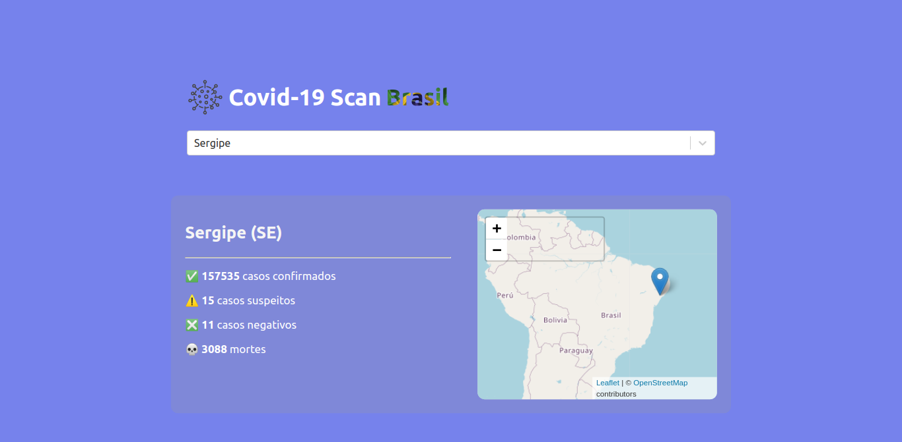

# Covid-19 Scan Brasil

<p>
  
</p>

## Tópicos 

[Sobre a aplicação](#sobre-a-aplicação)

[Tecnologias](#tecnologias)

[Instalação e uso](#instalação-e-uso)

<br>

## Sobre a aplicação
  O Covid-19 Scan Brasil é uma pequena aplicação para buscar e exibir informações sobre os números de casos da covid-19 em cada estado brasileiro, a partir da API pública: <a href="https://covid19-brazil-api.now.sh/">Covid-19 Brazil API</a>.


<br>

<p align="center">
    
  </a>
</p>

<br>

### Aplicação acessível em: [Covid19 Scan Brasil](https://covid19-scan-brasil.vercel.app/)

<br>

## Tecnologias

Tecnologias e ferramentas utilizadas no desenvolvimento do projeto:

- [React](https://reactjs.org/)
- [Styled Components](https://styled-components.com/)
- [axios](https://www.npmjs.com/package/axios)
- [Covid-19 Brazil API](https://covid19-brazil-api.now.sh/)
- [VS Code](https://code.visualstudio.com/) 
<br>

## Instalação e uso

```bash
# Abra um terminal e copie este repositório com o comando:
$ git clone https://github.com/felpssc/covid19-scan-brasil.git
# ou use a opção de download.

# Entre na pasta raiz do projeto e instale as dependências com:
$ yarn

# Rode a aplicação com:
$ yarn start

# Acesse http://localhost:3000 no seu navegador.
```

<br>

---

Feito por [Felipe Silva](https://github.com/felpssc) ;)

[](https://www.linkedin.com/in/felipesilva-1/) 
[](mailto:carlosfelipesilva.fs@gmail.com) 